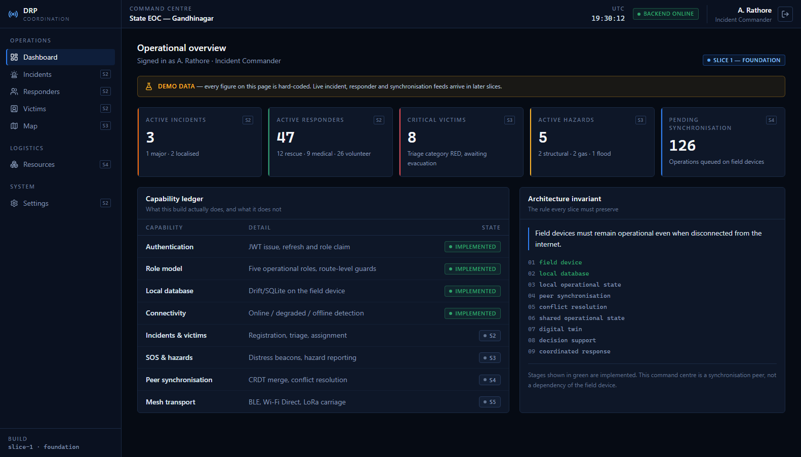

# Offline-First Disaster Response & Emergency Coordination Platform

**SIH 2026 prototype — Slice 1: Foundation**

> **Field devices must remain operational even when disconnected from the internet.**

---

## The problem

When an earthquake, flood or cyclone takes out the local network, the tools a
response team depends on stop working — at exactly the moment coordination
matters most. Teams fall back to paper and radio, casualty records are lost or
duplicated, hazards go unreported, and the command centre operates on a picture
that is hours stale.

The usual "offline mode" does not solve this. Caching the last server response
is useless to a responder who needs to *create* fifty triage records in a
basement with no signal.

## The core innovation

The field device's own database is the **primary operational datastore**, not a
cache.

```
Mobile → Local DB → (later) Sync Layer → Backend
```

and never

```
Mobile → Backend → Database
```

A responder registers a casualty, records a triage category and marks a hazard
against local storage. The record is complete and authoritative the moment it is
written. Synchronisation, when a link appears, reconciles peers — it is never a
precondition for doing the work.

The backend is a coordination **peer**: it holds the shared operational picture
and serves the command centre. It is not in the critical path of a responder in
the field.

## The command centre



Every figure on the dashboard is hard-coded and labelled as such — see
[`docs/screenshots/`](docs/screenshots) for the sign-in and placeholder pages.

## Architecture

```
FIELD DEVICE
    ↓
LOCAL DATABASE            ← implemented
    ↓
LOCAL OPERATIONAL STATE   ← implemented
    ↓
PEER SYNCHRONISATION
    ↓
CONFLICT RESOLUTION
    ↓
SHARED OPERATIONAL STATE
    ↓
DIGITAL TWIN
    ↓
DECISION SUPPORT
    ↓
COORDINATED RESPONSE
```

Slice 1 builds the first two stages and the structure the rest attach to. Full
detail in [`docs/architecture.md`](docs/architecture.md).

## Technology

| Layer | Stack |
| --- | --- |
| Mobile | Flutter · Dart · Riverpod · GoRouter · Drift/SQLite |
| Web | React · Vite · TypeScript · Tailwind CSS · React Router |
| Backend | Python 3.13 · FastAPI · SQLAlchemy 2 · Alembic · PyJWT · bcrypt |
| Database | PostgreSQL 16 · PostGIS 3.4 |
| Infrastructure | Docker Compose |

## Repository structure

```
disaster-response-platform/
├── mobile/              Flutter field application
├── web/                 React command centre
├── backend/             FastAPI coordination service
├── database/            PostGIS init scripts
├── docs/                architecture, slices, API
├── docker-compose.yml
├── .env.example
└── README.md
```

## Development setup

### Prerequisites

| Tool | Version | Needed for |
| --- | --- | --- |
| Python | 3.11+ (verified on 3.13.13) | backend |
| Node.js | 20+ (verified on 24.12) | web |
| Flutter SDK | 3.44+ (verified on 3.47.2 / Dart 3.13.2) | mobile |
| Docker Desktop | any current | PostgreSQL/PostGIS |

The backend and web app run without Docker or Flutter — see the notes under each
section.

**Windows only.** Building the mobile app for a device needs symlink support,
which means Developer Mode must be on (`start ms-settings:developers`). Without
it `flutter create` cannot link plugins; `flutter analyze` and `flutter test`
are unaffected.

### 1. Environment files

```bash
cp .env.example .env                  # docker-compose
cp backend/.env.example backend/.env  # backend
cp web/.env.example web/.env.local    # web (optional)
```

Generate the secrets:

```bash
python -c "import secrets; print(secrets.token_urlsafe(24))"   # POSTGRES_PASSWORD
python -c "import secrets; print(secrets.token_urlsafe(48))"   # JWT_SECRET_KEY
```

`JWT_SECRET_KEY` may be left blank in development — an ephemeral key is minted
per process, which means tokens do not survive a restart. Staging and production
refuse to start without one of at least 32 characters.

### 2. Start PostgreSQL + PostGIS

```bash
docker compose up -d db
docker compose logs -f db     # wait for "database system is ready to accept connections"
```

Data persists in the named volume `drp_db_data`. `docker compose down -v` wipes
it and re-runs `database/init/` on the next start.

### 3. Backend

```bash
cd backend
python -m venv .venv
.venv\Scripts\activate            # Windows
source .venv/bin/activate         # macOS / Linux

pip install -r requirements-dev.txt
alembic upgrade head
python -m app.db.seed
uvicorn app.main:app --reload
```

- API: <http://localhost:8000>
- Interactive docs: <http://localhost:8000/docs>
- Health: <http://localhost:8000/health>

**Without Docker.** Point `DATABASE_URL` at SQLite in `backend/.env`; every
command above works unchanged:

```
DATABASE_URL=sqlite+pysqlite:///./drp_dev.sqlite3
```

**Seeding.** `python -m app.db.seed` creates one account per role at
`@drp.example`. The password comes from `SEED_PASSWORD`; leave it blank and a
strong one is generated and printed once. No credential is ever committed.

### 4. Web command centre

```bash
cd web
npm install
npm run dev
```

<http://localhost:5173>. Sign in with a seeded account.

### 5. Mobile field app

The repository tracks `lib/`, `test/` and the pubspec. Native platform folders
and the Drift generated code are produced on your machine:

```powershell
cd mobile
./tool/bootstrap.ps1        # Windows
```

```bash
cd mobile
./tool/bootstrap.sh         # macOS / Linux
```

Then:

```bash
flutter analyze
flutter test
flutter run --dart-define=DRP_API_BASE_URL=http://10.0.2.2:8000/api/v1
```

`10.0.2.2` is the Android emulator's alias for the host loopback; use
`http://127.0.0.1:8000/api/v1` on desktop or the LAN address on a handset.

The app runs with **no backend at all** — choose *Continue in Offline Demo Mode*.
See [`mobile/README.md`](mobile/README.md).

### Everything at once

```bash
docker compose up -d --build     # PostGIS + API
cd web && npm run dev            # command centre
cd mobile && flutter run         # field device
```

## Environment variables

### Root `.env` (docker-compose)

| Variable | Default | Notes |
| --- | --- | --- |
| `POSTGRES_DB` | `drp` | |
| `POSTGRES_USER` | `drp_app` | |
| `POSTGRES_PASSWORD` | — | **Required.** Compose refuses to start without it. |
| `POSTGRES_PORT` | `5432` | Host port. |
| `API_PORT` | `8000` | Host port. |
| `ENVIRONMENT` | `development` | `development` · `test` · `staging` · `production` |
| `JWT_SECRET_KEY` | — | Required outside development. |
| `CORS_ORIGINS` | `http://localhost:5173,...` | Comma-separated. |
| `SEED_PASSWORD` | — | Blank generates one and prints it once. |

### `backend/.env`

Everything above, plus `DATABASE_URL`, `DATABASE_ECHO`, `LOG_LEVEL`,
`API_V1_PREFIX`, `ACCESS_TOKEN_EXPIRE_MINUTES`, `REFRESH_TOKEN_EXPIRE_MINUTES`.
See [`backend/.env.example`](backend/.env.example).

### `web/.env.local`

| Variable | Default |
| --- | --- |
| `VITE_API_BASE_URL` | `http://127.0.0.1:8000/api/v1` |
| `VITE_COMMAND_CENTRE_NAME` | `State EOC — Gandhinagar` |

Only `VITE_*` variables reach the browser. Never put a secret in them.

### Mobile

Configuration is compile-time, via `--dart-define`:

| Variable | Default |
| --- | --- |
| `DRP_API_BASE_URL` | `http://10.0.2.2:8000/api/v1` |

## Tests

```bash
cd backend && pytest        # 36 tests
cd web     && npm test      # 24 tests
cd mobile  && flutter test  # 45 tests
```

| Suite | Tests | Covers |
| --- | --- | --- |
| `backend/tests/test_health.py` | 3 | Liveness, readiness, versioned alias |
| `backend/tests/test_auth.py` | 20 | Login, refresh, `/me`, token typing, hashing, validation |
| `backend/tests/test_roles.py` | 4 | The five roles and `require_roles` |
| `backend/tests/test_config.py` | 9 | Secret-key and CORS configuration guards |
| `web/src/app/routing.test.tsx` | 10 | Startup, protected-route redirects |
| `web/src/app/authenticatedRoutes.test.tsx` | 11 | Session restore, dashboard, placeholders, sign-out |
| `web/src/features/auth/LoginPage.test.tsx` | 3 | Credential success, rejection, unreachable backend |
| `mobile/test/app_smoke_test.dart` | 7 | Boots the real app: splash, login, offline demo, home, placeholders, restart |
| `mobile/test/local_database_test.dart` | 11 | Drift init, schema, session persistence |
| `mobile/test/connectivity_test.dart` | 15 | `ONLINE`/`DEGRADED`/`OFFLINE` resolution |
| `mobile/test/auth_flow_test.dart` | 12 | Offline demo, sign-in, role model, redirect policy |

The backend suite runs against a temporary SQLite file, and the mobile suite
against an in-memory SQLite database, so neither needs Docker or PostgreSQL.

`mobile/test/app_smoke_test.dart` pumps the real `DisasterResponseApp` widget
and overrides only what needs a physical device — the database location and the
platform connectivity channel. It is the repeatable form of "the app launches".

## Implemented in Slice 1

**Backend** — layered FastAPI service; `/health` and `/health/ready`;
`/auth/login`, `/auth/refresh`, `/auth/me`; `users` table and five-role enum;
bcrypt hashing; JWT with enforced token typing; `require_roles` authorisation;
CORS; request validation; uniform error envelope; Alembic migration;
environment-driven seeding.

**Web** — command-centre shell with sidebar and top bar; login; protected routes
and session restore; dashboard with active incidents, active responders,
critical victims, active hazards and pending synchronisation (all labelled as
demo data); placeholder pages for the remaining modules.

**Mobile** — splash with real session restoration; login and offline demo mode;
role display and selection; responder home showing incident, role, connectivity
and local database status; profile and sign-out; Drift schema v1; connectivity
service; GoRouter across all eleven destinations.

**Infrastructure** — Docker Compose with PostgreSQL 16 + PostGIS 3.4, a
persistent volume, health checks, and first-boot extension provisioning.

## Deliberately not implemented

Victim registration, triage, SOS, GPS tracking, hazard detection, CRDT
synchronisation, mesh networking, the Digital Twin, AI, routing, hospital and
resource management, and advanced security (ZKP, DID, WebAuthn, blockchain,
device trust).

None of it is stubbed or simulated. Every unbuilt module renders a page naming
the slice that will deliver it. See [`docs/slices.md`](docs/slices.md).

## Known limitations

- **Two API listeners may be running at once.** Docker Compose maps the API to
  `API_PORT` (this machine uses `8001` because a local `uvicorn` already holds
  `8000`). The web app's `VITE_API_BASE_URL` defaults to port `8000`. Point it
  at whichever process you intend to use.
- **First Android build is slow.** Gradle `assembleDebug` takes about a minute
  on a cold cache. Subsequent runs are much faster.
- **Development JWT keys are ephemeral.** With `JWT_SECRET_KEY` blank, restarting
  the backend invalidates every issued token. Set one to avoid this.
- **The dashboard is fabricated.** Every figure is hard-coded in
  `web/src/features/dashboard/operationalSnapshot.ts` and labelled in the UI.
- **The mobile incident is fabricated.** Single constant in
  `mobile/lib/domain/entities/demo_data.dart`, labelled in the UI.
- **Vitest uses the `threads` pool.** The default `forks` pool fails to start
  workers when the repository path contains a space.

## Documentation

- [`docs/architecture.md`](docs/architecture.md) — the invariant, layering, data-model roadmap, security posture
- [`docs/slices.md`](docs/slices.md) — what each slice delivers
- [`docs/api.md`](docs/api.md) — endpoints, error envelope, roles
- [`mobile/README.md`](mobile/README.md) — bootstrap, layout, Drift workflow
- [`database/README.md`](database/README.md) — init vs. migrations, reset
